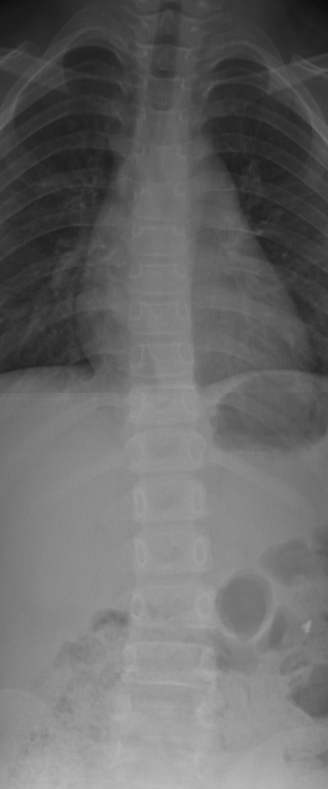

# IP_final_project
Vertebra Segmentation from Python using UNet with Resnet18 pretrained encoder.

### Input



## Installation
### Requirements
```
pip install -r requirements.txt
```
## Instruction

### Train 
```
python3 train.py
```

### Demo
```
python3 demo.py [-h] --checkpoint-path CHECKPOINT_PATH --demo-image DEMO_IMAGE --output-path OUTPUT_PATH

optional arguments:
  -h, --help            show this help message and exit
  --checkpoint-path CHECKPOINT_PATH
                        path to the checkpoint
  --demo-image DEMO_IMAGE
                        path to demo
  --label-image LABEL_IMAGE
                        path to label
  --output-path OUTPUT_PATH
                        path to output folder
```

